<div align="center">

# 🛡️ Open Source Security Operations Center

### Build a Complete SOC Automation Lab from Scratch

[](https://wazuh.com/)
[](https://azure.microsoft.com/)
[](https://thehive-project.org/)
[](https://shuffler.io/)

<br>

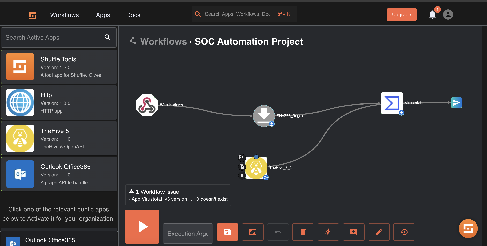

<br>

### 🔥 Automated Threat Detection | 📧 Real-time Email Alerts | 🤖 Full SOAR Integration

<br>

</div>

---

## 📖 Table of Contents

- [Project Overview](#-project-overview)
- [What You'll Learn](#-what-youll-learn)
- [Technology Stack](#-technology-stack)
- [Lab 1: Planning & Design](#-lab-1-planning--design)
- [Lab 2: Installation](#-lab-2-installation--deployment)
- [Lab 3: Configuration](#-lab-3-server-configuration)
- [Lab 4: Detection & Automation](#-lab-4-threat-detection--automation)
- [Results & Achievements](#-results--achievements)

---

## 🎯 Project Overview

This project demonstrates how to build a **professional-grade Security Operations Center (SOC)** in your home lab. You'll create an automated security system that detects threats, enriches alerts with threat intelligence, and notifies analysts—all in real-time.

### What This Project Does

The SOC automation system monitors a Windows 10 client for malicious activity (like Mimikatz credential dumping), automatically detects threats using Wazuh, enriches alerts with VirusTotal data through Shuffle, creates cases in The Hive, and sends detailed email notifications to security analysts.

<div align="center">

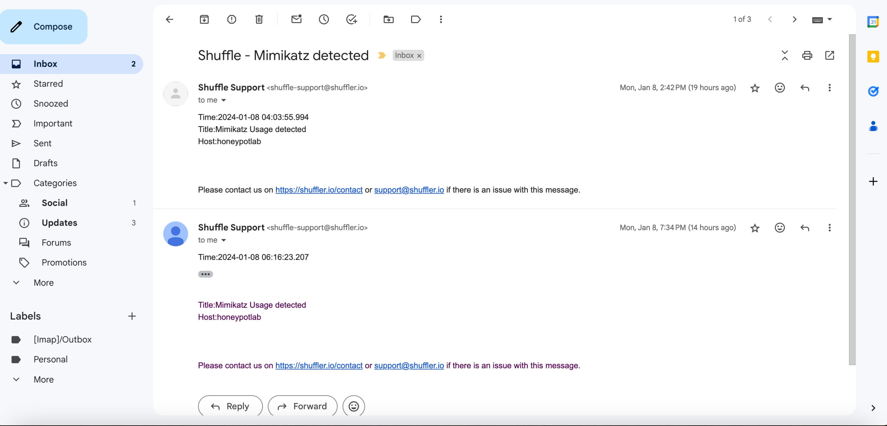

**Complete SOC pipeline that automatically detects threats and alerts analysts via email**

</div>

### Project Structure

This hands-on project consists of **4 progressive labs**:

- **Lab 1:** Design the architecture and plan the implementation
- **Lab 2:** Install and deploy all systems (Windows client, Wazuh, The Hive)
- **Lab 3:** Configure services and establish integrations
- **Lab 4:** Create detection rules and test automation

---

## 💡 What You'll Learn

By completing this project, you'll gain practical experience in:

✅ **SIEM Configuration** - Set up and manage Wazuh for security monitoring  
✅ **SOAR Integration** - Automate workflows using Shuffle  
✅ **Threat Detection** - Create custom detection rules for real attacks  
✅ **Case Management** - Manage security incidents with The Hive  
✅ **Cloud Infrastructure** - Deploy security systems on Microsoft Azure  
✅ **Log Analysis** - Parse and analyze Windows Sysmon events  
✅ **Incident Response** - Build automated alerting and notification systems  

---

## 🛠 Technology Stack

### Core Security Tools

| Tool | Version | Purpose |
|------|---------|---------|
| **Wazuh** | Latest | SIEM platform for log collection, analysis, and alerting |
| **The Hive** | Latest | Security incident response and case management |
| **Shuffle** | Latest | SOAR platform for automation and orchestration |
| **VirusTotal** | API v3 | Threat intelligence and IOC enrichment |
| **Sysmon** | Latest | Windows system monitoring and logging |

### Infrastructure

| Component | Technology | Purpose |
|-----------|-----------|---------|
| **Cloud Platform** | Microsoft Azure | Hosting Wazuh and The Hive servers |
| **Client OS** | Windows 10 | Monitored endpoint with Sysmon |
| **Server OS** | Ubuntu 20.04 | Operating system for security servers |
| **Test Tool** | Mimikatz | Credential dumping tool for testing detection |

---

<div align="center">

# 🎨 LAB 1: Planning & Design

**🎯 Goal:** Create a comprehensive architecture diagram to guide the implementation

</div>

## Overview

Before building any system, proper planning is essential. In this lab, you'll create a logical diagram that maps out all components, their connections, and the flow of data through your SOC automation system.

### Tools Needed

- **Draw.io** (free online diagramming tool at https://app.diagrams.net/)

---

## Architecture Components

Your SOC will consist of these key components:

### 1. Windows 10 Client
- **Role:** Monitored endpoint
- **Software:** Sysmon for detailed logging
- **Function:** Generates security events that flow to Wazuh

### 2. Wazuh Manager
- **Role:** SIEM and security analytics engine
- **Function:** Receives events, analyzes them, and generates alerts
- **Location:** Azure cloud VM

### 3. Shuffle (SOAR Platform)
- **Role:** Automation and orchestration
- **Function:** Receives alerts from Wazuh, enriches them with VirusTotal, creates cases in The Hive, and sends emails

### 4. The Hive
- **Role:** Case management system
- **Function:** Stores and manages security incidents
- **Location:** Azure cloud VM

### 5. VirusTotal
- **Role:** Threat intelligence provider
- **Function:** Enriches alerts with IOC (Indicator of Compromise) data

### 6. SOC Analyst
- **Role:** Human responder
- **Function:** Receives email alerts and responds to incidents

---

## Data Flow Diagram

The workflow follows this logical sequence:

```
┌─────────────────┐
│  Windows 10     │
│  + Sysmon       │
└────────┬────────┘
         │ 1. Sends Events
         ▼
┌─────────────────┐
│  Wazuh Manager  │
│  (SIEM)         │
└────────┬────────┘
         │ 2. Sends Alerts
         ▼
┌─────────────────┐
│  Shuffle        │
│  (SOAR)         │
└────┬───┬───┬────┘
     │   │   │
     │   │   │ 3a. Enriches IOCs
     │   │   └──────────► VirusTotal
     │   │
     │   │ 3b. Creates Case
     │   └──────────────► The Hive
     │
     │ 3c. Sends Email
     └──────────────────► SOC Analyst
```

### Color Coding System

Use different colors in your diagram to represent different types of connections:

- **Blue arrows:** Event flow (Windows → Wazuh)
- **Red arrows:** Alert flow (Wazuh → Shuffle)
- **Yellow arrows:** Enrichment (Shuffle → VirusTotal)
- **Green arrows:** Case creation (Shuffle → The Hive)
- **Purple arrows:** Notifications (Shuffle → Email)
- **Orange arrows:** Response actions (Analyst → System)

---

## Your Diagram Should Include

<div align="center">


**Complete SOC Architecture Diagram**

</div>

### Key Elements to Show

✅ All six components (Windows client, Wazuh, Shuffle, The Hive, VirusTotal, SOC Analyst)  
✅ Network connections between components  
✅ Direction of data flow (use arrows)  
✅ Labels explaining what each connection does  
✅ Color coding for different types of data flow  

---

## Lab 1 Completion Checklist

- [ ] Draw.io account created (or use without account)
- [ ] All 6 components added to diagram
- [ ] Data flow arrows drawn and labeled
- [ ] Color coding applied consistently
- [ ] Diagram saved for reference
- [ ] Understanding of how each component interacts

<div align="center">

**✅ Lab 1 Complete!**

**Next:** Lab 2 - Installing virtual machines and software

</div>

---

<div align="center">

# 💻 LAB 2: Installation & Deployment

**🎯 Goal:** Install Windows 10 with Sysmon, Wazuh server, and The Hive server

</div>

## Overview

In this lab, you'll install and configure all the systems needed for your SOC. You'll set up a Windows 10 client with Sysmon for monitoring, and deploy Wazuh and The Hive servers in Microsoft Azure.

---

## Deployment Architecture

### Cloud Infrastructure (Azure)
- **Wazuh Server** - Ubuntu 20.04 VM
- **The Hive Server** - Ubuntu 20.04 VM

### Local Infrastructure
- **Windows 10 Client** - With Sysmon installed

---

## Part 1: Understanding Wazuh

### What is Wazuh?

Wazuh is an open-source security platform that combines:
- **SIEM** (Security Information and Event Management)
- **XDR** (Extended Detection and Response)

### Wazuh Architecture

Wazuh consists of three main components:

| Component | Purpose |
|-----------|---------|
| **Wazuh Indexer** | Stores and indexes all security events for searching |
| **Wazuh Server** | Analyzes events and generates alerts based on rules |
| **Wazuh Dashboard** | Web interface for viewing alerts and managing the system |

### Key Capabilities

- 🔍 **Security Analytics** - Analyze security events in real-time
- 🚨 **Intrusion Detection** - Detect attacks and suspicious behavior
- 📋 **Incident Response** - Respond to security incidents
- ✅ **Compliance** - Meet regulatory requirements (PCI DSS, HIPAA, etc.)
- 🔎 **Threat Hunting** - Proactively search for threats
- 📊 **File Integrity Monitoring** - Track changes to critical files

---

## Part 2: Virtual Machine Setup

### Step 1: Create Azure Account

1. Go to https://azure.microsoft.com/
2. Sign up for a free account (includes $200 credit)
3. Complete account verification

### Step 2: Create Wazuh Server VM

1. Log into Azure Portal
2. Click "Create a resource" → "Virtual Machine"
3. Configure VM settings:
   - **Resource Group:** Create new (e.g., "SOC-Lab")
   - **VM Name:** "Wazuh-Server"
   - **Region:** Choose closest to you
   - **Image:** Ubuntu Server 20.04 LTS
   - **Size:** Standard_B2s (2 vCPUs, 4 GB RAM minimum)
   - **Authentication:** SSH public key or password
4. Configure networking:
   - Allow SSH (port 22)
   - Allow HTTPS (port 443)
   - Allow port 9200 (Wazuh indexer)
   - Allow port 55000 (Wazuh API)
5. Review and create VM
6. Note the public IP address

### Step 3: Create The Hive Server VM

Follow the same process as Wazuh server, but:
- **VM Name:** "TheHive-Server"
- **Networking:** Allow port 9000 (The Hive web interface)

### Step 4: Create Windows 10 VM (Local or Azure)

**Option A: Local VM (VirtualBox)**
1. Download VirtualBox
2. Download Windows 10 ISO
3. Create new VM with 4GB RAM, 50GB disk
4. Install Windows 10

**Option B: Azure VM**
1. Create VM using Windows 10 image
2. Configure RDP access (port 3389)

---

## Part 3: Sysmon Installation

### What is Sysmon?

Sysmon (System Monitor) is a Windows system service that:
- Logs detailed system activity
- Captures process creation, network connections, file changes
- Provides critical security telemetry
- Logs to Windows Event Log

### Installation Steps

**Step 1: Download Sysmon**

1. Open browser on Windows 10 VM
2. Go to: https://docs.microsoft.com/sysinternals/downloads/sysmon
3. Download Sysmon
4. Extract the ZIP file

**Step 2: Download Sysmon Configuration**

1. Go to: https://github.com/SwiftOnSecurity/sysmon-config
2. Download `sysmonconfig-export.xml`
3. Save to same folder as Sysmon

**Step 3: Install Sysmon**

1. Open PowerShell as Administrator
2. Navigate to Sysmon folder:
   ```powershell
   cd C:\Path\To\Sysmon
   ```
3. Install Sysmon with configuration:
   ```powershell
   .\Sysmon64.exe -accepteula -i sysmonconfig-export.xml
   ```

**Step 4: Verify Installation**

1. Open Event Viewer (eventvwr.msc)
2. Navigate to: Applications and Services Logs → Microsoft → Windows → Sysmon → Operational
3. You should see Sysmon events being logged

<div align="center">

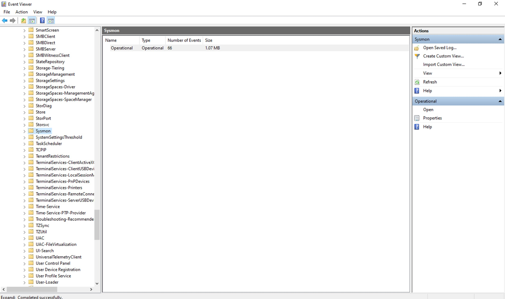

**Sysmon successfully installed and logging events**

</div>

---

## Part 4: Wazuh Server Installation

### Connect to Wazuh Server

1. Use SSH to connect to your Wazuh Azure VM:
   ```bash
   ssh username@<wazuh-public-ip>
   ```

### Install Wazuh

**Step 1: Download Installation Script**

```bash
curl -sO https://packages.wazuh.com/4.7/wazuh-install.sh
```

**Step 2: Run Installation**

```bash
sudo bash ./wazuh-install.sh -a
```

This will install:
- Wazuh indexer
- Wazuh server
- Wazuh dashboard

The installation takes 10-15 minutes.

**Step 3: Save Credentials**

At the end of installation, you'll see admin credentials. **Save these!**

```
Admin credentials:
Username: admin
Password: <random-password>
```

**Step 4: Access Wazuh Dashboard**

1. Open browser
2. Go to: `https://<wazuh-public-ip>`
3. Accept security warning (self-signed certificate)
4. Log in with admin credentials

### Installation Screenshots

<div align="center">

| Step 1 | Step 2 | Step 3 |
|:------:|:------:|:------:|
| 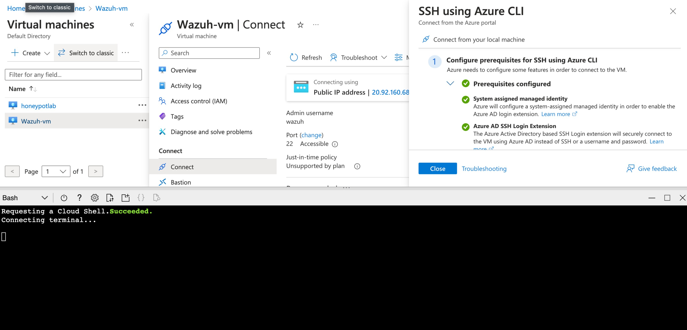 | 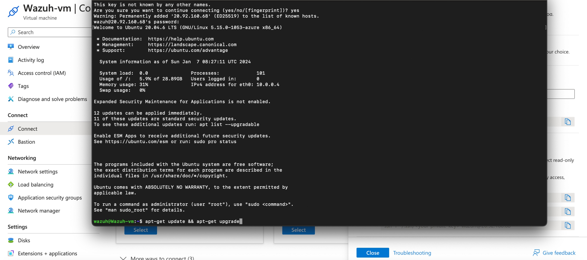 | 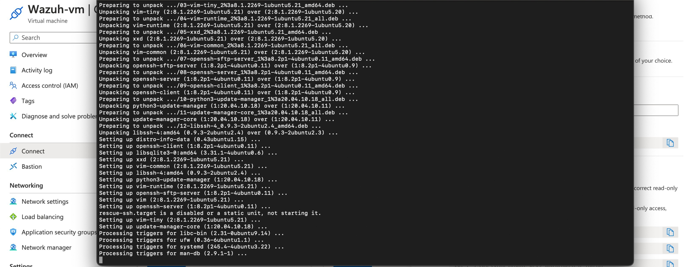 |
| Initial setup | Configuration | Service start |

| Step 4 | Step 5 | Step 6 |
|:------:|:------:|:------:|
| 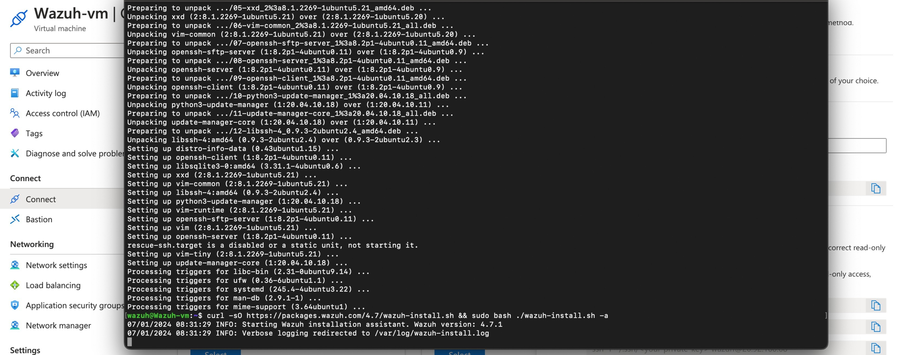 |  | 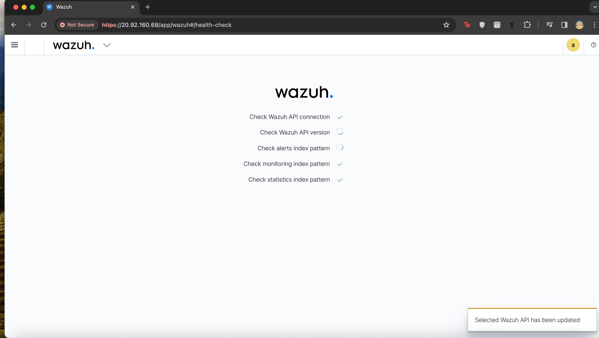 |
| Verification | Dashboard access | Complete |

</div>

---

## Lab 2 Completion Checklist

- [ ] Azure account created
- [ ] Wazuh server VM deployed
- [ ] The Hive server VM deployed
- [ ] Windows 10 client ready
- [ ] Sysmon installed on Windows client
- [ ] Sysmon logging verified in Event Viewer
- [ ] Wazuh installed on Ubuntu server
- [ ] Wazuh dashboard accessible via browser
- [ ] Admin credentials saved securely

<div align="center">

**✅ Lab 2 Complete!**

**Next:** Lab 3 - Configuring The Hive and connecting Wazuh agent

</div>

---

<div align="center">

# ⚡ LAB 3: Server Configuration

**🎯 Goal:** Configure The Hive and Wazuh, then connect the Windows client to Wazuh

</div>

## Overview

In this lab, you'll configure The Hive case management system and connect your Windows 10 client to the Wazuh server so events can flow from the client to the SIEM.

---

## Part 1: The Hive Configuration

The Hive requires three services to be configured:
1. **Cassandra** - Database backend
2. **Elasticsearch** - Search and indexing
3. **The Hive** - Main application

### Step 1: Configure Cassandra

**Connect to The Hive server:**
```bash
ssh username@<thehive-public-ip>
```

**Edit Cassandra configuration:**
```bash
sudo nano /etc/cassandra/cassandra.yaml
```

**Make these changes:**

Find and update these lines:
```yaml
listen_address: <thehive-public-ip>
rpc_address: <thehive-public-ip>
seed_provider:
  - class_name: org.apache.cassandra.locator.SimpleSeedProvider
    parameters:
      - seeds: "<thehive-public-ip>"
```

Save the file (Ctrl+X, Y, Enter).

<div align="center">

| Configuration File | Network Settings | Seed Provider |
|:------------------:|:----------------:|:-------------:|
| 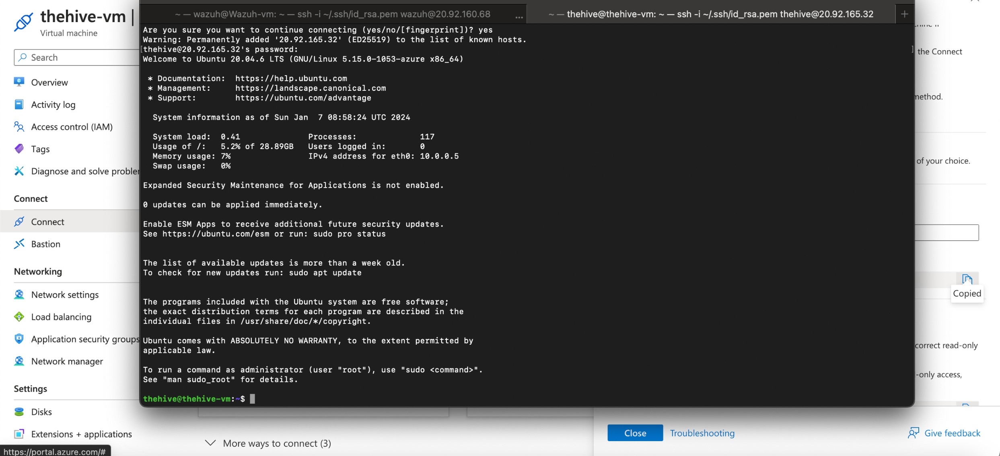 | 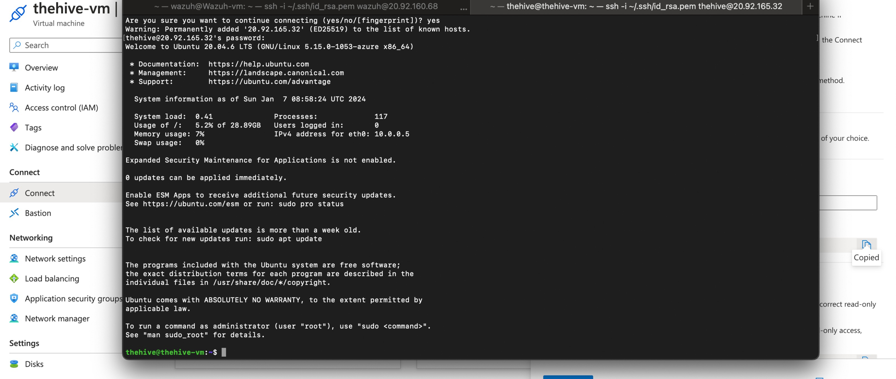 | 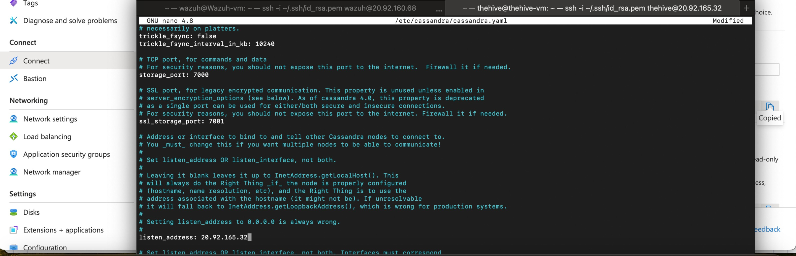 |

</div>

**Restart Cassandra:**

```bash
# Stop Cassandra
sudo systemctl stop cassandra

# Remove old data
sudo rm -rf /var/lib/cassandra/*

# Start Cassandra
sudo systemctl start cassandra

# Enable on boot
sudo systemctl enable cassandra
```

<div align="center">

| Stop Service | Clean Data | Start Service |
|:------------:|:----------:|:-------------:|
| 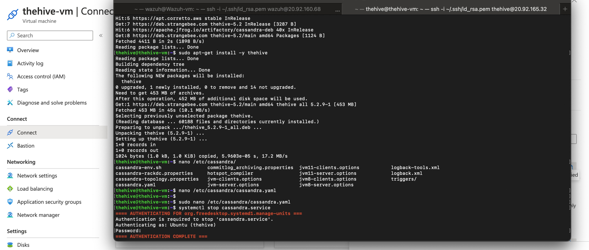 | | 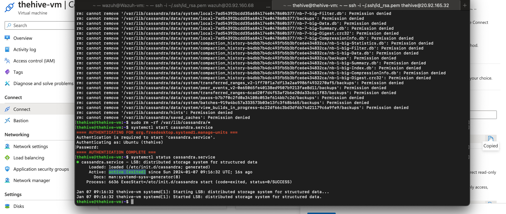 |

</div>

---

### Step 2: Configure Elasticsearch

**Edit Elasticsearch configuration:**
```bash
sudo nano /etc/elasticsearch/elasticsearch.yml
```

**Add or update these settings:**
```yaml
cluster.name: hive
node.name: node-1
network.host: <thehive-public-ip>
http.port: 9200
cluster.initial_master_nodes: ["node-1"]
```

**Start and enable Elasticsearch:**
```bash
sudo systemctl start elasticsearch
sudo systemctl enable elasticsearch
```

<div align="center">

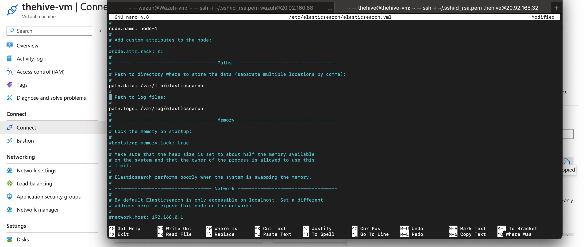

</div>

---

### Step 3: Set Permissions

**Give The Hive ownership of required directories:**

```bash
sudo chown -R thehive:thehive /opt/thp
```

<div align="center">


</div>

---

### Step 4: Configure The Hive

**Edit The Hive configuration:**
```bash
sudo nano /etc/thehive/application.conf
```

**Configure database and index settings:**
```conf
db {
  provider: janusgraph
  janusgraph {
    storage {
      backend: cql
      hostname: ["<thehive-public-ip>"]
      cql {
        cluster-name: hive
        keyspace: thehive
      }
    }
    index.search {
      backend: elasticsearch
      hostname: ["<thehive-public-ip>"]
      index-name: thehive
    }
  }
}
```

<div align="center">

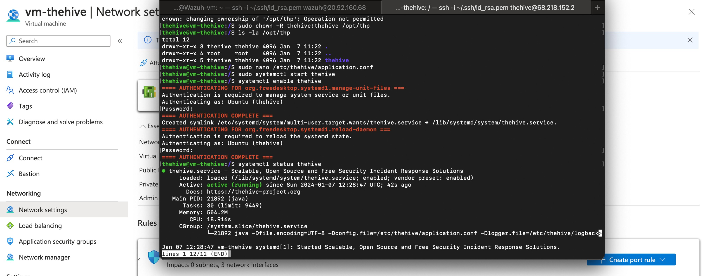

</div>

**Start The Hive:**
```bash
sudo systemctl start thehive
sudo systemctl enable thehive
```

---

### Step 5: Verify All Services

**Check service status:**
```bash
sudo systemctl status cassandra
sudo systemctl status elasticsearch
sudo systemctl status thehive
```

All three should show **"active (running)"** in green.

<div align="center">

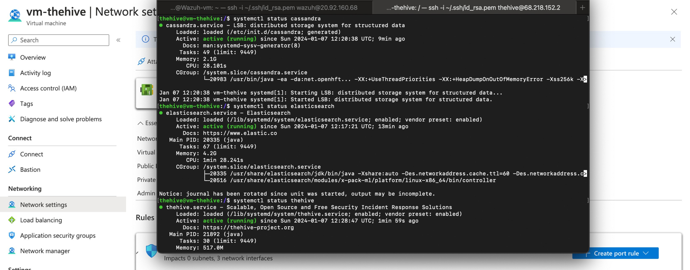

**✅ All services active and running**

</div>

**Access The Hive dashboard:**
1. Open browser
2. Go to: `http://<thehive-public-ip>:9000`
3. Default credentials:
   - Username: `admin@thehive.local`
   - Password: `secret`

> ⚠️ **Troubleshooting:** If you can't log in, Elasticsearch may need more memory. Edit `/etc/elasticsearch/jvm.options` and adjust heap size:
> ```
> -Xms2g
> -Xmx2g
> ```

---

## Part 2: Wazuh Agent Installation

### What is a Wazuh Agent?

The Wazuh agent is software installed on endpoints (like your Windows 10 client) that:
- Collects log data
- Monitors file integrity
- Detects rootkits and malware
- Sends all data to the Wazuh server

### Step 1: Add Agent in Wazuh Dashboard

1. Log into Wazuh dashboard at `https://<wazuh-public-ip>`
2. Click on "Agents" in the left menu
3. Click "Add agent"
4. Select:
   - **Operating system:** Windows
   - **Server address:** Wazuh server public IP
   - **Agent name:** Windows-Client (or any name)
5. Copy the installation command shown

### Step 2: Install Agent on Windows

1. RDP or open your Windows 10 client
2. Open PowerShell as Administrator
3. Paste and run the installation command from Wazuh dashboard
4. Start the Wazuh agent service:
   ```powershell
   NET START WazuhSvc
   ```

### Step 3: Verify Agent Connection

1. Go back to Wazuh dashboard
2. Click "Agents" in left menu
3. Your Windows client should appear with status "Active"
4. Click on the agent to see details and collected events

---

## Lab 3 Completion Checklist

- [ ] Cassandra configured and running
- [ ] Elasticsearch configured and running
- [ ] The Hive configured and running
- [ ] The Hive dashboard accessible
- [ ] Wazuh agent installed on Windows client
- [ ] Agent showing as "Active" in Wazuh dashboard
- [ ] Events flowing from Windows client to Wazuh

<div align="center">

**✅ Lab 3 Complete!**

**Next:** Lab 4 - Creating detection rules and testing Mimikatz detection

</div>

---

<div align="center">

# 🚀 LAB 4: Threat Detection & Automation

**🎯 Goal:** Configure Wazuh to detect Mimikatz, create custom alerts, and verify the complete automation workflow

</div>

## Overview

In this final lab, you'll configure your SOC to detect a real attack (Mimikatz credential dumping), create custom detection rules, and verify that alerts are automatically generated and sent to analysts via email.

---

## Part 1: Configure Wazuh to Collect Sysmon Logs

### Step 1: Modify Wazuh Agent Configuration

**On Windows 10 client:**

1. Navigate to: `C:\Program Files (x86)\ossec-agent\`
2. Right-click `ossec.conf` → Open with Notepad (as Administrator)

**Step 2: Add Sysmon Log Collection**

Find the `<ossec_config>` section and add this configuration:

```xml
<localfile>
  <location>Microsoft-Windows-Sysmon/Operational</location>
  <log_format>eventchannel</log_format>
</localfile>
```

This tells Wazuh to collect Sysmon events from Windows Event Log.

<div align="center">

| Open Configuration | Add Sysmon Source | Save Changes |
|:------------------:|:-----------------:|:------------:|
| 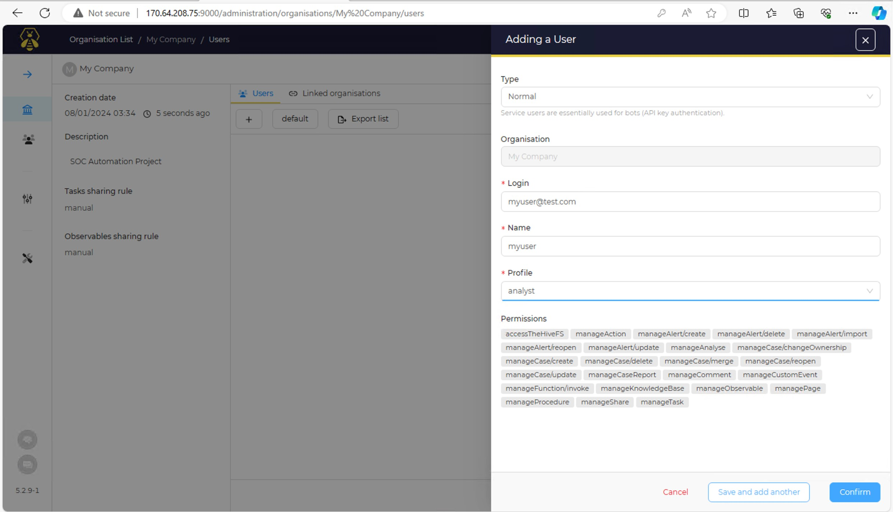 | 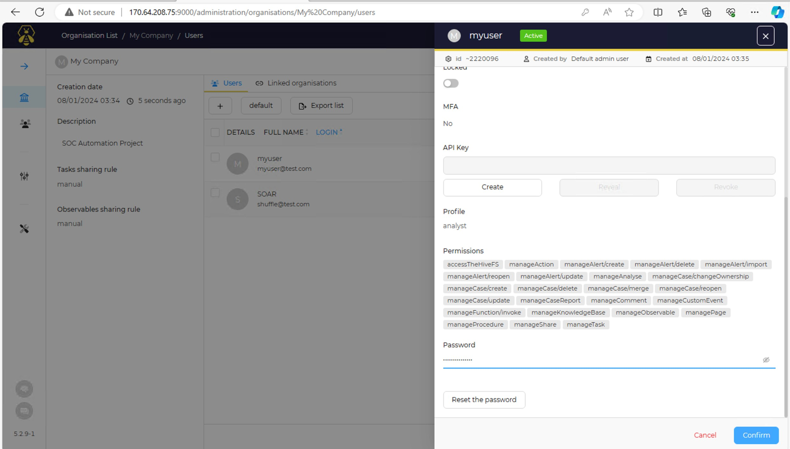 | 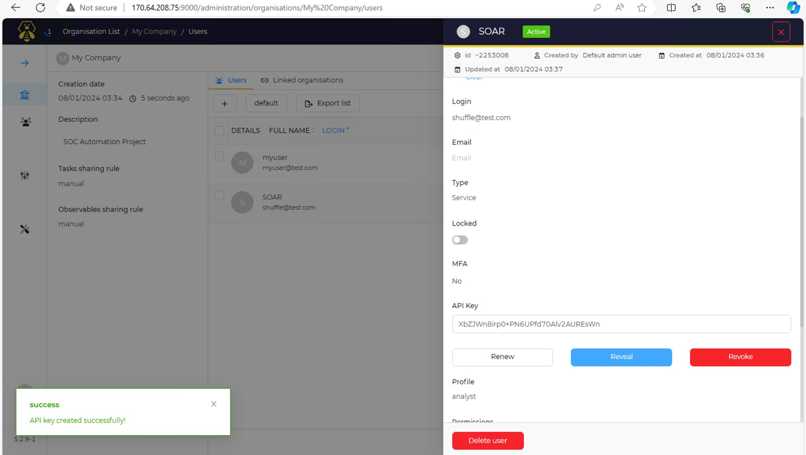 |

</div>

**Step 3: Restart Wazuh Agent**

Open PowerShell as Administrator:
```powershell
Restart-Service WazuhSvc
```

---

## Part 2: Mimikatz Testing Setup

### What is Mimikatz?

Mimikatz is a post-exploitation tool that can:
- Extract passwords from memory
- Dump credentials
- Generate Kerberos tickets
- Perform pass-the-hash attacks

**In a real attack:** Attackers use Mimikatz to steal credentials after compromising a system.

**In this lab:** We'll use it to test our detection capabilities.

### Step 1: Disable Windows Defender

**Temporarily disable real-time protection:**

1. Open Windows Security
2. Go to Virus & threat protection
3. Manage settings
4. Turn off Real-time protection

**OR** exclude the Downloads folder:
1. Windows Security → Virus & threat protection
2. Manage settings → Add or remove exclusions
3. Add folder → Select Downloads

### Step 2: Download Mimikatz

1. Go to: https://github.com/gentilkiwi/mimikatz/releases
2. Download the latest `mimikatz_trunk.zip`
3. Extract to Downloads folder

<div align="center">

| Disable Defender | Download Mimikatz | Extract Files |
|:----------------:|:-----------------:|:-------------:|
| 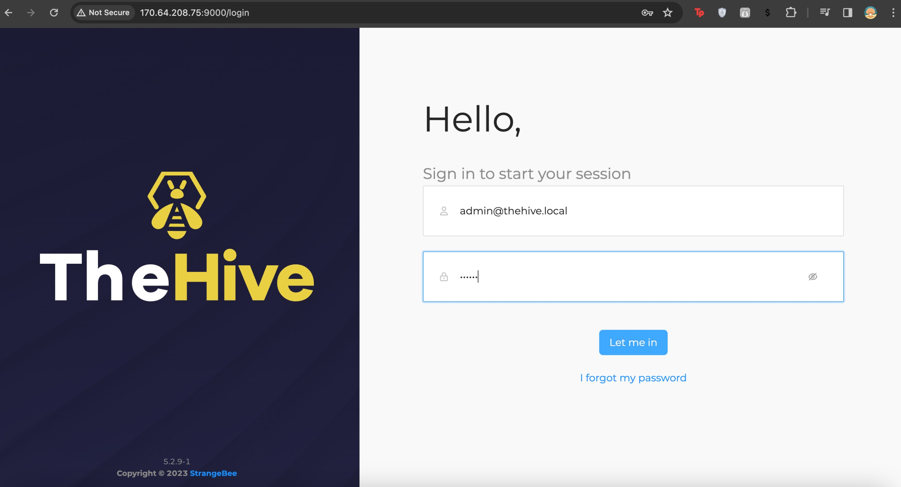 |  |  |

</div>

### Step 3: Run Mimikatz

1. Open PowerShell as Administrator
2. Navigate to Mimikatz folder:
   ```powershell
   cd C:\Users\<username>\Downloads\mimikatz_trunk\x64
   ```
3. Run Mimikatz:
   ```powershell
   .\mimikatz.exe
   ```

<div align="center">

| Open PowerShell | Navigate to Folder | Execute Mimikatz |
|:---------------:|:------------------:|:----------------:|
|  | | 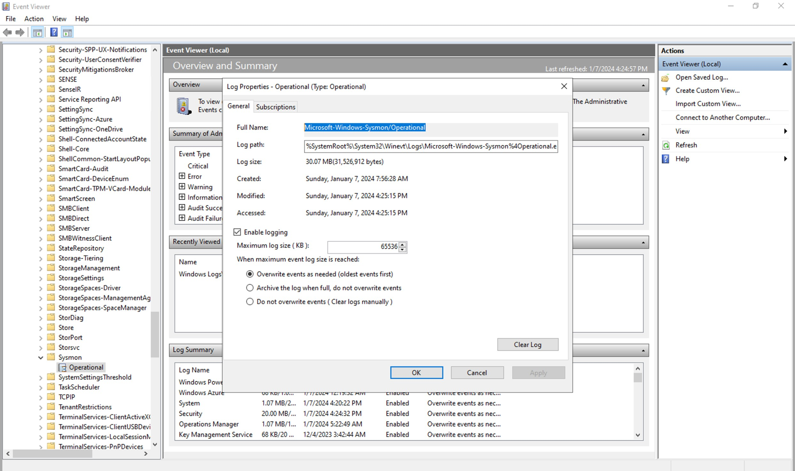 |

</div>

### Step 4: Verify Events in Wazuh

1. Log into Wazuh dashboard
2. Go to "Security events"
3. Search for Sysmon events
4. Look for events containing "mimikatz" or process creation events

You should see Sysmon Event ID 1 (Process Creation) when Mimikatz runs.

---

## Part 3: Enable Archive Logging

To create custom rules, we need to see the full event data.

### Step 1: Configure Wazuh Server for Logging

**SSH into Wazuh server:**
```bash
ssh username@<wazuh-public-ip>
```

**Edit Wazuh configuration:**
```bash
sudo nano /var/ossec/etc/ossec.conf
```

**Find the `<global>` section and set:**
```xml
<global>
  <logall>yes</logall>
  <logall_json>yes</logall_json>
</global>
```

**Restart Wazuh manager:**
```bash
sudo systemctl restart wazuh-manager
```

<div align="center">

| Edit Configuration | Enable Logging | Restart Service |
|:------------------:|:--------------:|:---------------:|
|  | 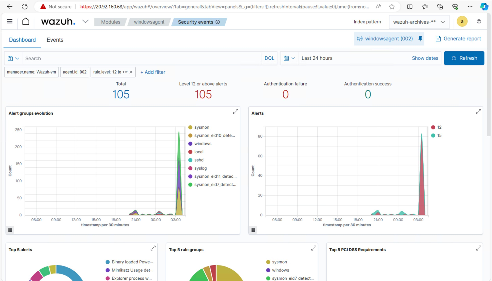 | |

</div>

### Step 2: Configure Filebeat for Archiving

**Edit Filebeat configuration:**
```bash
sudo nano /etc/filebeat/filebeat.yml
```

**Find and modify archives setting:**
```yaml
archives:
  enabled: true
```

**Restart Filebeat:**
```bash
sudo systemctl restart filebeat
```

### Step 3: Create Index in Wazuh Dashboard

1. Log into Wazuh dashboard
2. Go to Stack Management → Index Patterns
3. Create new index pattern: `wazuh-archives-*`
4. Select timestamp field: `@timestamp`

Now you can search archived events to find Mimikatz patterns.

---

## Part 4: Create Custom Detection Rule

### Step 1: Analyze Mimikatz Events

1. In Wazuh dashboard, go to "Discover"
2. Select `wazuh-archives-*` index
3. Search for Mimikatz-related events
4. Look for Sysmon Event ID 1 with "mimikatz.exe" in the command line

**Example event data to note:**
- Original file name: `mimikatz.exe`
- Command line: Contains `mimikatz`
- Event ID: 1 (Process Creation)

<div align="center">

| Search Events | Analyze Data | Identify Patterns |
|:-------------:|:------------:|:-----------------:|
| 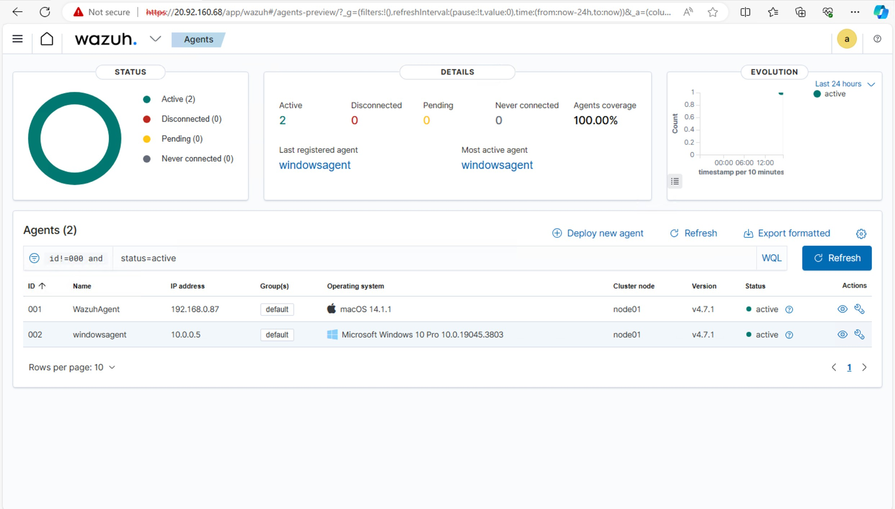 | 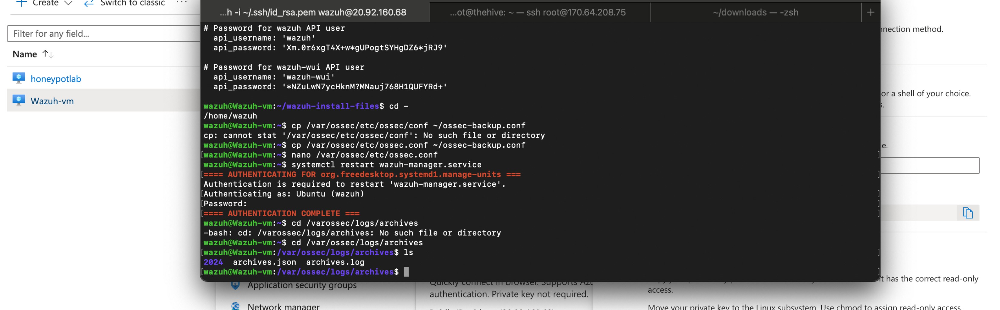 | 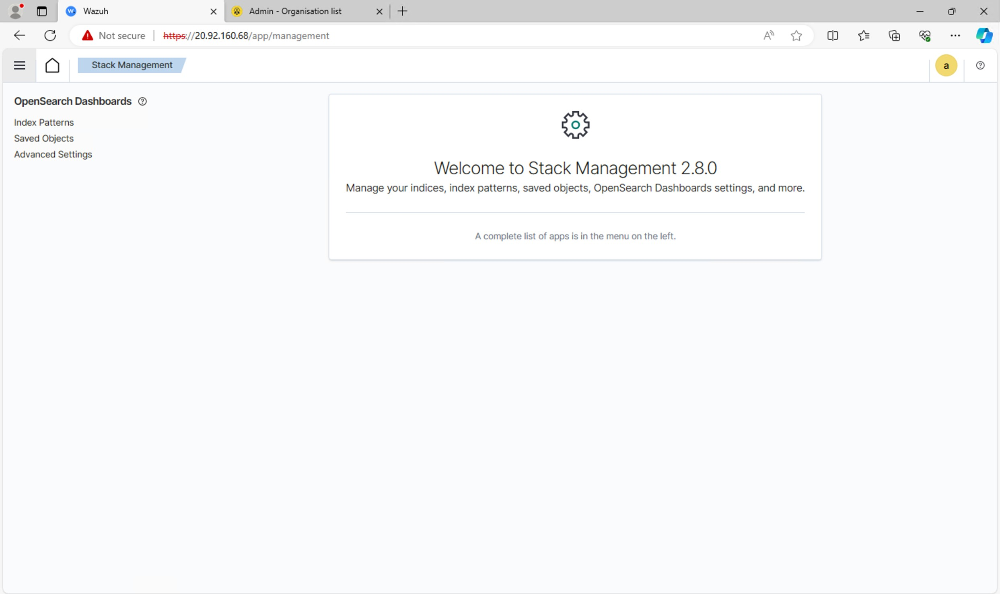 |

</div>

### Step 2: Create Custom Rule File

**SSH into Wazuh server:**
```bash
sudo nano /var/ossec/etc/rules/local_rules.xml
```

**Add this custom rule:**

```xml
<group name="sysmon,">
  <rule id="100002" level="15">
    <if_group>sysmon_event1</if_group>
    <field name="win.eventdata.originalFileName" type="pcre2">(?i)mimikatz\.exe</field>
    <description>Mimikatz Usage Detected</description>
    <mitre>
      <id>T1003</id>
    </mitre>
  </rule>
</group>
```

**Rule explanation:**
- `id="100002"`: Custom rule ID (100000+ for user rules)
- `level="15"`: High severity (scale 0-15)
- `if_group="sysmon_event1"`: Triggers on Sysmon process creation events
- `field name="win.eventdata.originalFileName"`: Checks the original file name
- `type="pcre2"`: Uses regex pattern matching
- `(?i)mimikatz\.exe`: Case-insensitive match for "mimikatz.exe"
- `mitre id="T1003"`: Maps to MITRE ATT&CK technique (Credential Dumping)

<div align="center">

| Create Rule File | Define Detection Logic | Add MITRE Mapping |
|:----------------:|:----------------------:|:-----------------:|
| 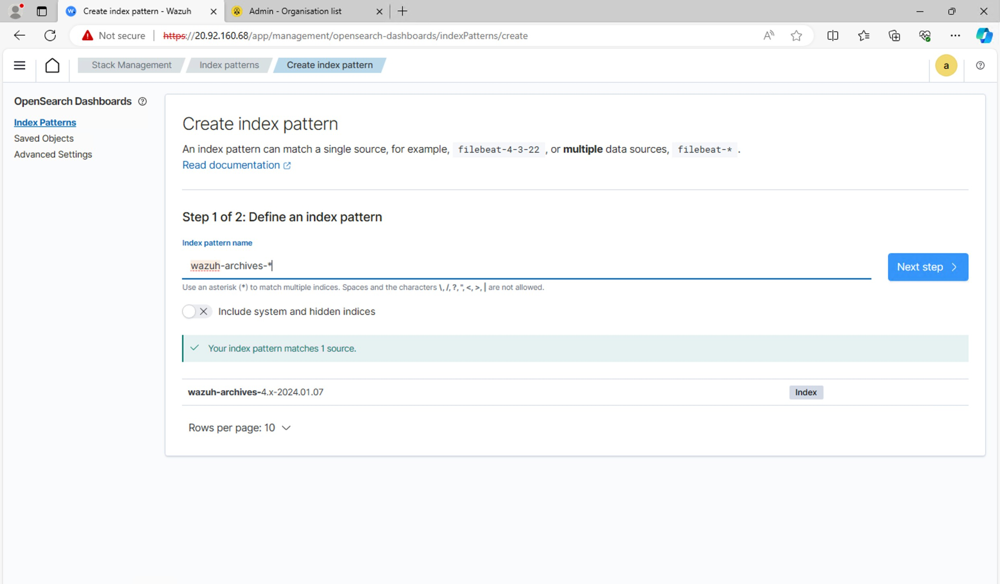 | 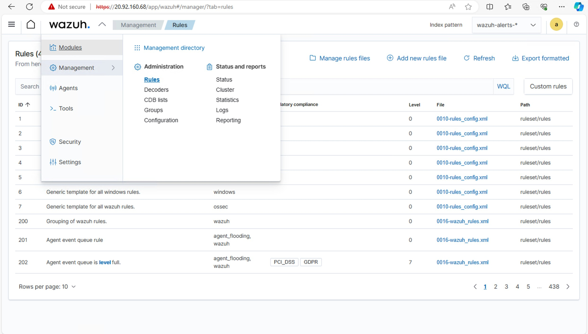 | 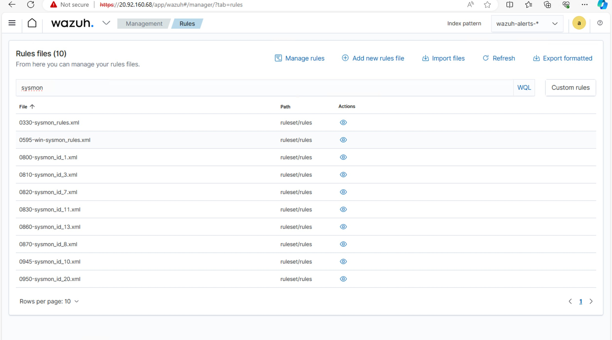 |

</div>

### Step 3: Test Rule Syntax

**Check for syntax errors:**
```bash
sudo /var/ossec/bin/wazuh-logtest
```

This opens an interactive testing tool. You can paste a sample Mimikatz event to test if your rule triggers.

**Restart Wazuh manager:**
```bash
sudo systemctl restart wazuh-manager
```

<div align="center">

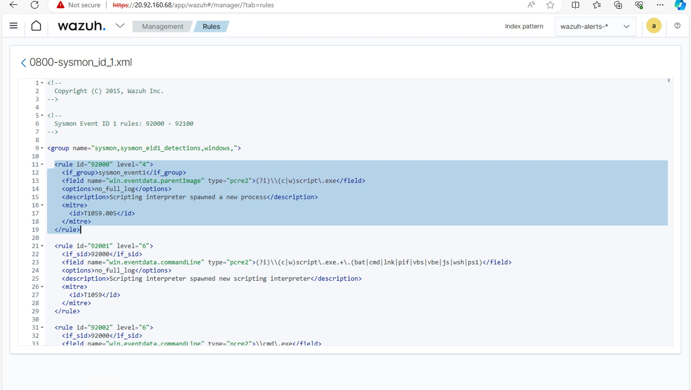

</div>

---

## Part 5: Test Detection & Automation

### Step 1: Execute Mimikatz Again

On Windows 10 client:
1. Open PowerShell as Administrator
2. Navigate to Mimikatz folder
3. Run `.\mimikatz.exe`
4. Type `exit` to close Mimikatz

### Step 2: Verify Alert in Wazuh

1. Go to Wazuh dashboard
2. Click "Security Events"
3. Look for Rule ID 100002
4. You should see alert: "Mimikatz Usage Detected"

<div align="center">

| Execute Test | Event Captured | Alert Generated |
|:------------:|:--------------:|:---------------:|
|  | 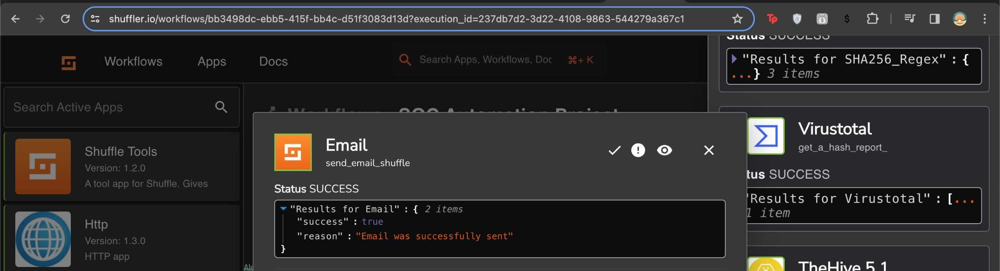 |  |

</div>

### Step 3: View Alert Details

Click on the alert to see:
- Full event data
- MITRE ATT&CK mapping (T1003 - Credential Dumping)
- Process information
- User context
- Timestamp

<div align="center">

| Alert Dashboard | Detailed View | MITRE Mapping |
|:---------------:|:-------------:|:-------------:|
| 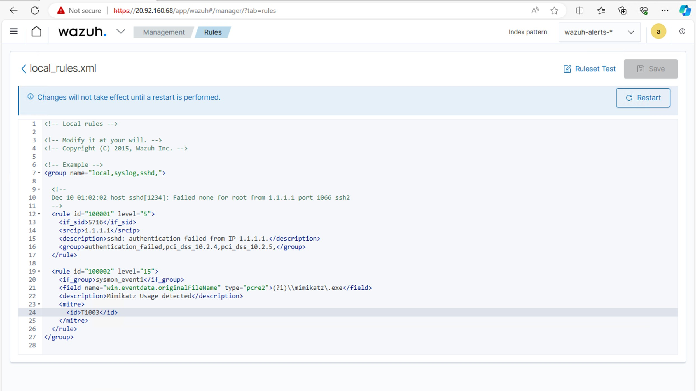 |  | 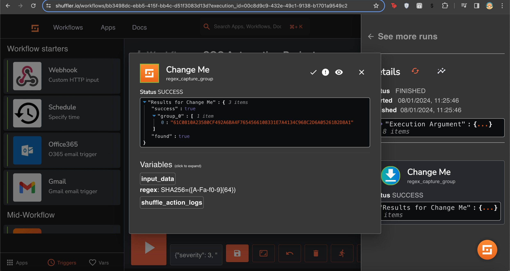 |

</div>

---

## Part 6: Understanding the Complete Workflow

### Data Flow Summary

Here's what happens when Mimikatz is executed:

```
1. User runs Mimikatz on Windows 10
   ↓
2. Sysmon detects process creation (Event ID 1)